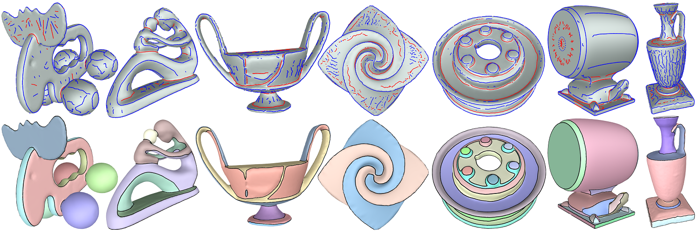

# Mesh Segmentation

This repository contains the source code for the paper [Feature-Aligned Segmentation using Correlation Clustering](http://yixina.net/projects/FeatureSeg/FeatureSeg_CVM17.pdf). The tool provides a very flexible way of segmenting a mesh into patches whose boundaries are aligned with prominent ridge and valley lines of the shape.

    

### Project Page

### Clone the repo and install dependencies

This implementation uses [Qt5.12.2 vs2015_x64] [Visual C++ 2015 x64] [boost_1_67_0 ].
Other dependencies can be found in the folder ./libs/.

We use the source code of [Trimesh](http://graphics.stanford.edu/software/trimesh/) and [Crestline](http://www2.riken.jp/brict/Yoshizawa/Research/Crest.html) in our project.

## License

[MIT](https://github.com/ThibaultGROUEIX/AtlasNet/blob/master/license_MIT)
